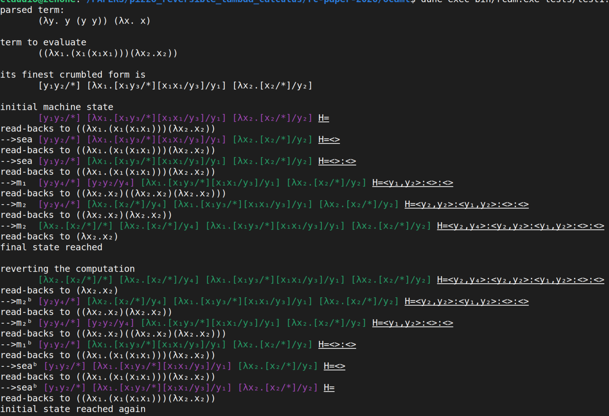

# Reversible Crumbled Abstract Machines

This repository contains an implementation in OCaml of a Reversible Crumbled Abstract Machine, described in the paper *A Reversible Crumbling Abstract Machine for Plotkin's Call-by-Value* by Nicolò Pizzo and Claudio Sacerdoti Coen, submitted at *Reversible Computation (RC) 2026*.

The implementation allows to efficiently reduce a term of Plotkin's (weak, closed) Call-By-Value to normal form, using space and time that are bi-linear in the size of the initial term to be reduced and in the number of reduction steps required.  Moreover, the implementation, which is based on a new variant of Crumbled Abstract Machine, remembers enough information to be able to revert the computation, going back one step at a time.

## Installing the dependencies
To compile the software one needs a fully function opam + dune + OCaml installation. If you don't have one yet, simply follow the instructions at the [opam website](https://opam.ocaml.org/doc/Install.html).

Once opam is installed, type
    opam install core_unix
to install the only dependency required.

## Running the program

You can run the program typing
    dune exec bin/rcam.exe FILENAME
in a Unix/Linux shell with dark background suggested.

The `FILENAME` is the name of a file containing a term to be evaluated. Examples can be found in the directory `tests`.
The allowed concrete syntax for terms is
> t ::= x | tt | \x.t | λx.t | (t)

where variables like `x` are single letters, `\` and `λ` are synonyms and application is associative to the left.

The term to be evaluated is crumbled and then it is executed running the machine in forward mode untile the final state is reached.
Then the machine direction is reverted and the machine is run again until the initial state is reached again.

## Example of output

